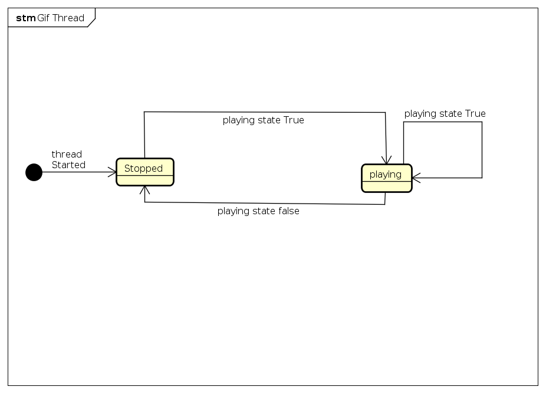

Challenge 3
===

# Running

In the root directory of this project there is a file called `startUI.sh`, run that and the UI should start. Libraries need in the venv or on the system are pyqt5 and bluezero.

the path `source/` has the simple microbit source for setting up the services for bluetooth

you have to find the address for the microbit in your distros bluetooth settings

# State Diagram

